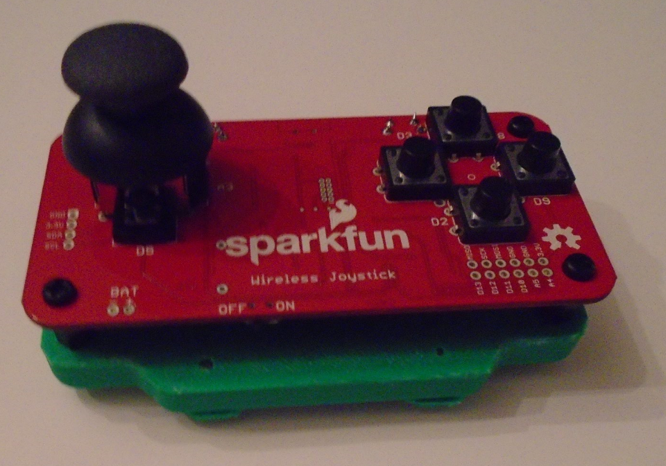
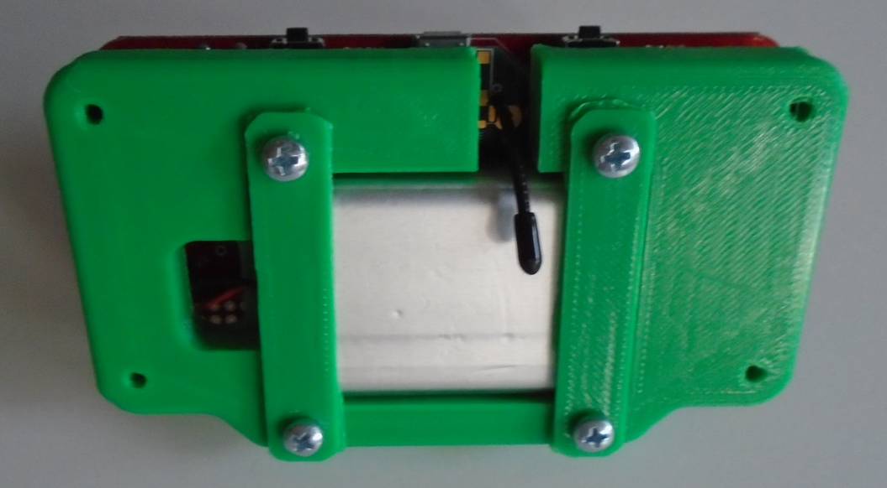

# WirelessJoystick
Stuff pertaining to the Sparkfun wireless joystick kit

STL contains 3D printable case for use with 1000mAh battery

WJK_ControlGeneric_Byte: contains code for use on the Wireless Joystick Kit itself.
  for use with button config.
  it turns the values of the buttons/joystick into two bytes and sends them alternately
WJK_Output_Processing_Byte: contains processing3 code for use with an XBee explorer

WJK_Reciever_Generic: template arduino code for an arduino project that is on the recieving end of the Joystick.

TODO - add processing3 keyboard spoof of joystick that uses XBee explorer.

SparkfunXbee_4Nov17.pdf: contains overview & explanation of the code.

CAD: https://grabcad.com/library/wjk_body-1

